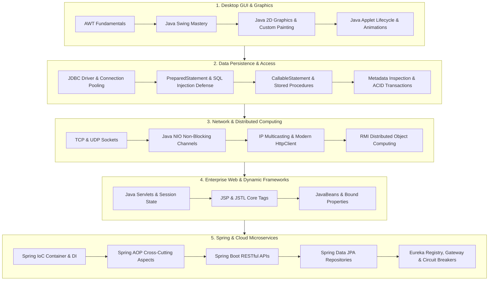

<div align="center">

# ☕ Advanced Java & Enterprise Engineering Master Suite
### *The Definitive Reference Architecture, Code Repository & Interactive Web IDE for Advanced Java Development*

[](https://ken-kanike.github.io/AdvanceJava/)
[](https://www.oracle.com/java/)
[](LICENSE)
[](https://spring.io/projects/spring-boot)
[](https://github.com/Ken-Kanike/AdvanceJava/stargazers)
[](https://github.com/Ken-Kanike/AdvanceJava)

---

### 🌐 COMPANION REPOSITORY & LIVE DEMO
* 💻 **Interactive Browser IDE**: [https://ken-kanike.github.io/AdvanceJava/](https://ken-kanike.github.io/AdvanceJava/)
* 📘 **Core Java Companion Repository**: [https://github.com/Ken-Kanike/java](https://github.com/Ken-Kanike/java) *(Covers OOP, Collections, Generics, Lambdas, and Multithreading)*

---

</div>

## 📖 Overview

Welcome to the **AdvanceJava** knowledge repository. This codebase represents an end-to-end, enterprise-grade curriculum designed to take engineers from standard Java syntax to advanced systems engineering, distributed architecture, and microservices.

Every module is stand-alone, fully documented, sanitized for security, and runnable directly inside the browser using our [Interactive Web IDE](https://ken-kanike.github.io/AdvanceJava/).

---

## 🗺️ Learning Roadmap & Architecture



---

## 📂 Repository Structure & Module Catalog (153+ Source Files)

### 🎨 1. AWT & Java Swing (`01_AWT_and_Swing/` & `Swing/`)
| File | Topic / Concept | Description |
| :--- | :--- | :--- |
| [`01_AWT_and_Swing/StudentManagementSystemGUI.java`](01_AWT_and_Swing/StudentManagementSystemGUI.java) | Desktop Mini-Project | Full CRUD desktop application with `TableRowSorter` real-time search, form validation, and metrics calculation. |
| [`01_AWT_and_Swing/SwingComponentsDemo.java`](01_AWT_and_Swing/SwingComponentsDemo.java) | Core Controls & Trees | Showcase of `JFrame`, `JTabbedPane`, `JTable`, `JTree`, `JSlider`, `JProgressBar`, `JCheckBox`, `JRadioButton`. |
| [`01_AWT_and_Swing/LayoutManagersDemo.java`](01_AWT_and_Swing/LayoutManagersDemo.java) | Layout Managers | Side-by-side comparison of `BorderLayout`, `FlowLayout`, `GridLayout`, `GridBagLayout`, `CardLayout`, and `BoxLayout`. |
| [`01_AWT_and_Swing/EventHandlingDemo.java`](01_AWT_and_Swing/EventHandlingDemo.java) | Delegation Event Model | Event handling for `ActionListener`, `ItemListener`, `KeyListener`, `MouseListener`, and `WindowAdapter`. |
| [`01_AWT_and_Swing/CustomGraphicsDemo.java`](01_AWT_and_Swing/CustomGraphicsDemo.java) | Java 2D Graphics | High-DPI anti-aliased rendering, linear gradients, Bézier curves, and real-time interactive drawing canvas. |
| [`Swing/DemoTable.java`](Swing/DemoTable.java) | JTable | Scrollable data grid visualization with DefaultTableModel. |
| [`Swing/DemoTree.java`](Swing/DemoTree.java) & [`DemoTree2.java`](Swing/DemoTree2.java) | JTree | Hierarchical navigation nodes with TreeModel and TreeSelectionListener. |
| [`Swing/PrBar1.java`](Swing/PrBar1.java) | JProgressBar | Progress tracking and bounds styling. |
| [`Swing/Tooltips1.java`](Swing/Tooltips1.java) | Tooltips | Hover-activated tooltip styling. |

---

### 🌐 2. Java Applets & Graphics (`02_Applets_and_Graphics/`)
| File | Topic / Concept | Description |
| :--- | :--- | :--- |
| [`02_Applets_and_Graphics/AppletLifecycleDemo.java`](02_Applets_and_Graphics/AppletLifecycleDemo.java) | Applet Lifecycle | Visual lifecycle state monitor (`init`, `start`, `paint`, `stop`, `destroy`). |
| [`02_Applets_and_Graphics/Graphics2DDemo.java`](02_Applets_and_Graphics/Graphics2DDemo.java) | Graphics2D Shapes | Vector shapes, custom star `GeneralPath`, pie charts, and gradients. |
| [`02_Applets_and_Graphics/BannerAnimationApplet.java`](02_Applets_and_Graphics/BannerAnimationApplet.java) | Multithreaded Animation | Thread-driven scrolling ticker banner and elastic bouncing ball collision physics. |

---

### 🗄️ 3. JDBC Database Connectivity (`03_JDBC_Database/` & `JDBC/`)
| File | Topic / Concept | Description |
| :--- | :--- | :--- |
| [`03_JDBC_Database/JdbcConnectionManager.java`](03_JDBC_Database/JdbcConnectionManager.java) | Connection Pooling | Centralized driver registration, connection pooling simulation, and secure configurations. |
| [`03_JDBC_Database/PreparedStatementCrudDemo.java`](03_JDBC_Database/PreparedStatementCrudDemo.java) | PreparedStatement CRUD | Full parameterized queries preventing SQL injection attacks. |
| [`03_JDBC_Database/CallableStatementDemo.java`](03_JDBC_Database/CallableStatementDemo.java) | Stored Procedures | Invoking SQL stored procedures with `IN` and `OUT` parameter binding. |
| [`03_JDBC_Database/MetadataDemo.java`](03_JDBC_Database/MetadataDemo.java) | Runtime Metadata | Inspecting `ResultSetMetaData` (columns, types) and `DatabaseMetaData` (server features). |
| [`03_JDBC_Database/TransactionManagementDemo.java`](03_JDBC_Database/TransactionManagementDemo.java) | ACID Transactions | Manual transaction control (`setAutoCommit(false)`, `commit()`, `rollback()`, Savepoints). |
| [`JDBC/jdbcDemo1/src/StudentDao.java`](JDBC/jdbcDemo1/src/StudentDao.java) | DAO Pattern | Complete Data Access Object pattern implementation for enterprise student management. |
| [`JDBC/jdbcDemo1/src/StudentAppMain.java`](JDBC/jdbcDemo1/src/StudentAppMain.java) | JDBC App Runner | Interactive CLI runner executing full JDBC database workflow. |

---

### 🔌 4. Socket & High-Performance Networking (`04_Socket_Networking/` & `Networking/`)
| File | Topic / Concept | Description |
| :--- | :--- | :--- |
| [`04_Socket_Networking/InetAddressAndUrlDemo.java`](04_Socket_Networking/InetAddressAndUrlDemo.java) | DNS & HTTP URLs | DNS lookup, IP resolution, host validation, and HTTP URL connections. |
| [`04_Socket_Networking/TcpEchoServer.java`](04_Socket_Networking/TcpEchoServer.java) & [`TcpEchoClient.java`](04_Socket_Networking/TcpEchoClient.java) | TCP Socket Streams | Reliable, bidirectional client-server communication over TCP streams. |
| [`04_Socket_Networking/UdpChatServer.java`](04_Socket_Networking/UdpChatServer.java) & [`UdpChatClient.java`](04_Socket_Networking/UdpChatClient.java) | UDP Datagram Packets | Connectionless packet messaging via `DatagramSocket` and `DatagramPacket`. |
| [`04_Socket_Networking/MultiThreadedChatServer.java`](04_Socket_Networking/MultiThreadedChatServer.java) & [`MultiThreadedChatClient.java`](04_Socket_Networking/MultiThreadedChatClient.java) | Broadcast Chat Architecture | Concurrent multi-client chat room with `ExecutorService` thread pool and client handlers. |
| [`04_Socket_Networking/JavaNioNonBlockingEchoServer.java`](04_Socket_Networking/JavaNioNonBlockingEchoServer.java) | Java NIO (Non-blocking I/O) | Multiplexed I/O utilizing `Selector`, `ServerSocketChannel`, and `ByteBuffer`. |
| [`04_Socket_Networking/MulticastGroupDemo.java`](04_Socket_Networking/MulticastGroupDemo.java) | IP Multicasting | One-to-many group broadcasting with `MulticastSocket` on Class D multicast groups. |
| [`04_Socket_Networking/ModernHttpClientDemo.java`](04_Socket_Networking/ModernHttpClientDemo.java) | Java 11+ HttpClient | Asynchronous non-blocking HTTP requests with `CompletableFuture`, JSON payloads, and HTTP/2. |
| [`04_Socket_Networking/FileTransferServer.java`](04_Socket_Networking/FileTransferServer.java) & [`FileTransferClient.java`](04_Socket_Networking/FileTransferClient.java) | Binary File Streaming | Protocol header negotiation and 4KB buffered binary chunk streaming over TCP. |

---

### ⚙️ 5. Servlets & Enterprise Web (`05_Servlets_and_Enterprise/`)
| File | Topic / Concept | Description |
| :--- | :--- | :--- |
| [`05_Servlets_and_Enterprise/HelloServlet.java`](05_Servlets_and_Enterprise/HelloServlet.java) | Servlet Lifecycle | `init`, `doGet`, `doPost`, `destroy` lifecycle and visitor metrics. |
| [`05_Servlets_and_Enterprise/RequestResponseDemoServlet.java`](05_Servlets_and_Enterprise/RequestResponseDemoServlet.java) | Request & Response | HTTP header inspection, query parameter parsing, and status code generation. |
| [`05_Servlets_and_Enterprise/SessionManagementServlet.java`](05_Servlets_and_Enterprise/SessionManagementServlet.java) | Session State & Cookies | State tracking via `HttpSession`, session timeout management, and client cookies. |
| [`05_Servlets_and_Enterprise/DatabaseServlet.java`](05_Servlets_and_Enterprise/DatabaseServlet.java) | JDBC Servlet Integration | Dynamic web database query processing and formatted HTML table output. |
| [`05_Servlets_and_Enterprise/web.xml`](05_Servlets_and_Enterprise/web.xml) | Deployment Descriptor | Standard web application XML deployment configuration and servlet mappings. |

---

### 🌐 6. RMI & Distributed Computing (`06_RMI_and_Distributed/`)
| File | Topic / Concept | Description |
| :--- | :--- | :--- |
| [`06_RMI_and_Distributed/BankingService.java`](06_RMI_and_Distributed/BankingService.java) | Remote Interface | Contract extending `java.rmi.Remote` declaring distributed banking operations. |
| [`06_RMI_and_Distributed/BankingServiceImpl.java`](06_RMI_and_Distributed/BankingServiceImpl.java) | Remote Implementation | Distributed service implementation extending `UnicastRemoteObject`. |
| [`06_RMI_and_Distributed/RmiBankingServer.java`](06_RMI_and_Distributed/RmiBankingServer.java) | RMI Registry Host | Hosts RMI Registry on port 1099 and registers remote object stub. |
| [`06_RMI_and_Distributed/RmiBankingClient.java`](06_RMI_and_Distributed/RmiBankingClient.java) | RMI Client Lookup | Discovers remote object via `Naming.lookup` and executes remote procedure calls. |

---

### 📄 7. JSP & JSTL Dynamic Web (`07_JSP_and_JSTL/`)
| File | Topic / Concept | Description |
| :--- | :--- | :--- |
| [`07_JSP_and_JSTL/index.jsp`](07_JSP_and_JSTL/index.jsp) | JSP Architecture | Directives, declarations, scriptlets, expressions, and implicit server objects. |
| [`07_JSP_and_JSTL/students.jsp`](07_JSP_and_JSTL/students.jsp) | JSTL Core Taglib | Iteration and conditional evaluation via `<c:forEach>`, `<c:if>`, `<c:choose>`, `<c:out>`. |
| [`07_JSP_and_JSTL/bean_demo.jsp`](07_JSP_and_JSTL/bean_demo.jsp) | Standard Action Tags | Integrating POJO JavaBeans with `<jsp:useBean>`, `<jsp:setProperty>`, `<jsp:getProperty>`. |

---

### ☕ 8. JavaBeans & Introspection (`08_Java_Beans_and_Enterprise/`)
| File | Topic / Concept | Description |
| :--- | :--- | :--- |
| [`08_Java_Beans_and_Enterprise/EmployeeBean.java`](08_Java_Beans_and_Enterprise/EmployeeBean.java) | Enterprise JavaBean | Serializable POJO with getter/setter conventions and `PropertyChangeSupport`. |
| [`08_Java_Beans_and_Enterprise/BeanBoundPropertiesDemo.java`](08_Java_Beans_and_Enterprise/BeanBoundPropertiesDemo.java) | Bound Properties | Decoupled observer pattern triggering `PropertyChangeEvent` on property modification. |
| [`08_Java_Beans_and_Enterprise/BeanIntrospectionDemo.java`](08_Java_Beans_and_Enterprise/BeanIntrospectionDemo.java) | Runtime Introspection | Inspecting property descriptors, read/write methods, and reflection execution via `Introspector`. |

---

### 🍃 9. Spring Framework Core (`09_Spring_Framework/`)
| File | Topic / Concept | Description |
| :--- | :--- | :--- |
| [`09_Spring_Framework/IoCContainerAndDiDemo.java`](09_Spring_Framework/IoCContainerAndDiDemo.java) | IoC & Dependency Injection | Complete Inversion of Control container, `@Autowired` field injection, singleton scope, and `@PostConstruct`/`@PreDestroy` hooks. |
| [`09_Spring_Framework/SpringBeanConfigurationDemo.java`](09_Spring_Framework/SpringBeanConfigurationDemo.java) | Java Configuration | Modern `@Configuration`, `@Bean`, `@Primary`, `@Qualifier`, and externalized `@Value` properties. |
| [`09_Spring_Framework/SpringAopAspectDemo.java`](09_Spring_Framework/SpringAopAspectDemo.java) | Spring AOP & Proxies | Decoupled cross-cutting aspects with `@Before`, `@AfterReturning`, `@AfterThrowing`, and `@Around` advice via Dynamic Proxies. |

---

### 🚀 10. Spring Boot & Cloud Microservices (`10_Spring_Boot_and_Microservices/`)
| File | Topic / Concept | Description |
| :--- | :--- | :--- |
| [`10_Spring_Boot_and_Microservices/SpringBootApplicationDemo.java`](10_Spring_Boot_and_Microservices/SpringBootApplicationDemo.java) | Boot Auto-Configuration | `@SpringBootApplication` composite bootstrap, embedded container initialization, and environment profiles. |
| [`10_Spring_Boot_and_Microservices/SpringBootRestControllerDemo.java`](10_Spring_Boot_and_Microservices/SpringBootRestControllerDemo.java) | RESTful API Controller | Full REST endpoints (`@RestController`, `@GetMapping`, `@PostMapping`, `@PutMapping`, `@DeleteMapping`, `@PathVariable`, `@RequestBody`). |
| [`10_Spring_Boot_and_Microservices/GlobalExceptionHandlerDemo.java`](10_Spring_Boot_and_Microservices/GlobalExceptionHandlerDemo.java) | Centralized Error Handling | `@RestControllerAdvice`, `@ExceptionHandler`, and RFC 7807 `ProblemDetail` JSON errors. |
| [`10_Spring_Boot_and_Microservices/SpringDataJpaRepositoryDemo.java`](10_Spring_Boot_and_Microservices/SpringDataJpaRepositoryDemo.java) | Spring Data JPA | Relational `@Entity` mapping, `JpaRepository` CRUD, and derived queries (`findByDepartment`). |
| [`10_Spring_Boot_and_Microservices/MicroserviceArchitectureDemo.java`](10_Spring_Boot_and_Microservices/MicroserviceArchitectureDemo.java) | Cloud Microservices | Netflix Eureka Service Registry, API Gateway routing, Resilience4j Circuit Breaker with fallbacks, and Actuator metrics. |

---

### 📝 11. Practical Exam Question Bank Solutions (`AJPprExam_QBsoln/`)
| File | Exam Question | Solution Highlights |
| :--- | :--- | :--- |
| [`AJPprExam_QBsoln/.../Q1.java`](AJPprExam_QBsoln/src/ajpprexam_qbsoln/Q1.java) | Q1: AWT Component Hierarchy | Labels, TextFields, Buttons, and Checkbox Groups layout. |
| [`AJPprExam_QBsoln/.../Q2.java`](AJPprExam_QBsoln/src/ajpprexam_qbsoln/Q2.java) | Q2: AWT Checkbox & Choice | Choice dropdown and multi-select checkbox events. |
| [`AJPprExam_QBsoln/.../Q3.java`](AJPprExam_QBsoln/src/ajpprexam_qbsoln/Q3.java) | Q3: List Box Operations | Dynamic list item addition and selection events. |
| [`AJPprExam_QBsoln/.../Q4.java`](AJPprExam_QBsoln/src/ajpprexam_qbsoln/Q4.java) | Q4: FlowLayout & BorderLayout | Region arrangement and component positioning. |
| [`AJPprExam_QBsoln/.../Q5.java`](AJPprExam_QBsoln/src/ajpprexam_qbsoln/Q5.java) | Q5: GridLayout Calculator | 3x3 grid matrix layout arithmetic calculator. |
| [`AJPprExam_QBsoln/.../Q6.java`](AJPprExam_QBsoln/src/ajpprexam_qbsoln/Q6.java) | Q6: CardLayout Wizard | Multi-step interactive panel navigation. |
| [`AJPprExam_QBsoln/.../Q7.java`](AJPprExam_QBsoln/src/ajpprexam_qbsoln/Q7.java) | Q7: MenuBar & MenuItems | Menu navigation, Shortcuts, and Dialog popups. |
| [`AJPprExam_QBsoln/.../Q8.java`](AJPprExam_QBsoln/src/ajpprexam_qbsoln/Q8.java) | Q8: Applet Parameter Passing | Reading `<param>` tags inside `Applet.init()`. |
| [`AJPprExam_QBsoln/.../Q9.java`](AJPprExam_QBsoln/src/ajpprexam_qbsoln/Q9.java) | Q9: Graphics Polygon & Arcs | Vector drawing of multi-point polygons and arcs. |
| [`AJPprExam_QBsoln/.../Q10.java`](AJPprExam_QBsoln/src/ajpprexam_qbsoln/Q10.java) | Q10: MouseListener & MouseMotionListener | Mouse click coordinates, dragging, and hover effects. |
| [`AJPprExam_QBsoln/.../Q11.java`](AJPprExam_QBsoln/src/ajpprexam_qbsoln/Q11.java) | Q11: KeyListener Keyboard Events | KeyPressed, KeyReleased, and typed character tracking. |
| [`AJPprExam_QBsoln/.../Q12.java`](AJPprExam_QBsoln/src/ajpprexam_qbsoln/Q12.java) | Q12: WindowAdapter Close Events | Clean window closing and confirmation dialogs. |
| [`AJPprExam_QBsoln/.../Q13.java`](AJPprExam_QBsoln/src/ajpprexam_qbsoln/Q13.java) | Q13: Swing JTabbedPane | Multi-tab container organizing controls. |
| [`AJPprExam_QBsoln/.../Q14.java`](AJPprExam_QBsoln/src/ajpprexam_qbsoln/Q14.java) | Q14: Swing JTable & Model | Tabular record rendering and column formatting. |
| [`AJPprExam_QBsoln/.../Q15.java`](AJPprExam_QBsoln/src/ajpprexam_qbsoln/Q15.java) | Q15: Swing JTree Hierarchies | Expandable folder hierarchy with TreeNode. |
| [`AJPprExam_QBsoln/.../Q16.java`](AJPprExam_QBsoln/src/ajpprexam_qbsoln/Q16.java) | Q16: JProgressBar & JSlider | Slider bound events updating progress bar fill. |
| [`AJPprExam_QBsoln/.../Q17.java`](AJPprExam_QBsoln/src/ajpprexam_qbsoln/Q17.java) | Q17: Sockets Client-Server | Bidirectional TCP message exchange. |
| [`AJPprExam_QBsoln/.../Q18.java`](AJPprExam_QBsoln/src/ajpprexam_qbsoln/Q18.java) | Q18: JDBC Database Queries | Connecting to MySQL database and fetching rows. |
| [`AJPprExam_QBsoln/.../Q19/`](AJPprExam_QBsoln/src/ajpprexam_qbsoln/Q19/) | Q19: Web Servlet Form Processor | Processing HTML form input and generating response. |
| [`AJPprExam_QBsoln/.../Q20.java`](AJPprExam_QBsoln/src/ajpprexam_qbsoln/Q20.java) | Q20: Servlet Session State | Tracking user login credentials across pages. |

---

### 💻 12. NetBeans Projects, Practicals & Archives
| Directory | Description |
| :--- | :--- |
| [`AJP Netbeans/`](AJP%20Netbeans/) | NetBeans GUI designs, student management UI iterations (`StudentUI`, `StudentUI2`, `StudentUI3`), `DbCode.java`, and `AjpMicroProjectFinal.java`. |
| [`Practicals/`](Practicals/) | Academic laboratory practical exercises covering lists, frames, and event handling (`pr1x1` to `pr2xiii2`). |
| [`TextBook/Unit 1 - AWT/`](TextBook/Unit%201%20-%20AWT/) | Textbook reference implementations for foundational AWT components (`program1_1` to `program1_7`). |
| [`Swing/`](Swing/) | Extensive Swing sample programs (`prg1` through `prg13`, `DemoTable`, `DemoTree`, `PrBar1`, `Tooltips1`). |
| [`Networking/`](Networking/) | Socket networking archives (`ChatServer`, `ChatClient`, `DemoInet`, `DemoURL`, `UDPserver`, `UDPclient`). |
| [`NetbeansJava/`](NetbeansJava/) | Maven enterprise starter application with JVM memory heap diagnostics. |

---

## 🛠️ Quick Start & Execution

### Prerequisites
* **Java Development Kit (JDK)**: JDK 8+ (JDK 17 or 21 LTS recommended).
* **Build Tools**: Apache Maven 3.8+ (Optional for Maven modules).
* **Database**: MySQL Server 8.0+ (Optional for live database queries; safe mock simulation included).

### Compiling & Running Demos

#### 1. Compile Any Module Track
```bash
# Example: Compile Swing Desktop Module
javac 01_AWT_and_Swing/*.java

# Example: Compile Sockets & Networking Module
javac 04_Socket_Networking/*.java

# Example: Compile Spring Boot Architecture Module
javac 10_Spring_Boot_and_Microservices/*.java
```

#### 2. Run Interactive Demos
```bash
# Launch Student Management System GUI
java 01_AWT_and_Swing.StudentManagementSystemGUI

# Launch Multi-Threaded Chat Server
java socket_networking.MultiThreadedChatServer

# Launch Spring Boot Architecture Demo
java spring_boot_and_microservices.SpringBootApplicationDemo
```

---

## 🔒 Security & Privacy Policy
This repository is pre-sanitized for open-source distribution. All database credentials, secret keys, personal tokens, and machine-specific file paths have been replaced with safe mock values (`password123`, `root`, `Alice Johnson`).

---

## 📄 License
This repository is licensed under the **MIT License**. See the [`LICENSE`](LICENSE) file for complete details.

---

<div align="center">

**[AdvanceJava Repository](https://github.com/Ken-Kanike/AdvanceJava)** • Maintained by **[Ken-Kanike](https://github.com/Ken-Kanike)**  
*Empowering developers to build high-performance, distributed, and cloud-ready Java enterprise applications.*  
*Looking for Core Java? Check out [Ken-Kanike/java](https://github.com/Ken-Kanike/java).*

</div>
